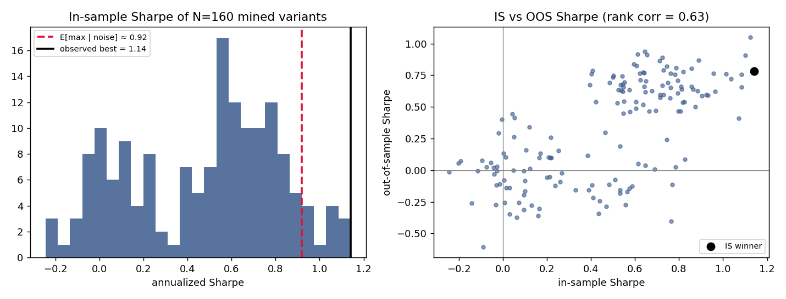

# Project 1 — Multiple Testing & the Deflated Sharpe Ratio

**Skill demonstrated:** the single most important discipline in quant research — recognizing that a headline Sharpe from a *search* is inflated, and correcting for it. **Data:** Binance BTCUSDT daily, 2017–2026 (free, no key). **Reproduce:** `python run.py`.

## The question

Most backtests report one number: the Sharpe of the best rule found. This project asks the question a senior researcher asks first: **how many rules did you try, and is the winner distinguishable from luck?**

## Method

I mined a family of **N = 160** moving-average crossover rules on BTC (fast ∈ {5…50}, slow ∈ {50…250}, long-only and long/short), each traded next-bar (`.shift(1)`, no look-ahead) and **net of a realistic 6 bps round-turn cost**. The sample is split 60/40 into in-sample (2017-08→2022-12) and a locked out-of-sample (2022-12→2026-06). I then applied three checks the naive backtest skips:

1. **The False Strategy Theorem** (Bailey & López de Prado): the expected *maximum* Sharpe from N zero-skill strategies grows with the dispersion of trial Sharpes and √(2 ln N). Compare the observed best against this noise benchmark.
2. **The Deflated Sharpe Ratio (DSR)**: the probability the winner's Sharpe is real after deflating for N trials and the return distribution's skew/kurtosis. Advisory pass ≥ 0.95.
3. **IS→OOS persistence**: does the in-sample ranking survive out of sample?

## Results (real, from `run.py`)

| Metric | Value | Reading |
|---|---|---|
| Strategies mined (N) | **160** | the trial count — the number every naive backtest omits |
| Best in-sample Sharpe | **1.14** | looks like a real edge |
| Expected max Sharpe from pure noise | **0.92** | what a search this size produces *by luck* |
| Observed / noise ratio | **1.24×** | the "edge" is barely above the noise floor |
| **Deflated Sharpe Ratio** | **0.696** | **FAIL** (< 0.95) — not distinguishable from luck |
| Best variant, out-of-sample Sharpe | **0.78** | decays from 1.14 IS → 0.78 OOS |
| IS→OOS rank correlation (N variants) | 0.63 | some persistence (BTC's secular trend), but not enough to make the winner reliable |

## Verdict

The best-of-160 BTC trend rule has an in-sample Sharpe of 1.14 — and it is **only 1.24× what an identical search of pure noise would have produced**, with a **Deflated Sharpe Ratio of 0.70 (a fail)**. A researcher who reported "Sharpe 1.14" without the trial count would be reporting luck. This is the discipline that separates a researcher from a backtester: *count the trials, deflate the Sharpe, and lock the out-of-sample window.*

> **Honest limitation:** the IS→OOS rank correlation (0.63) shows the MA family does carry some real trend signal (BTC trended hard 2017–2026), so this is not a *pure* placebo — but the *specific winner's* magnitude is selection-inflated and fails deflation. The correct conclusion is "weak, unreliable edge," not "Sharpe 1.14."
